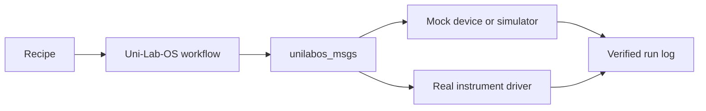

<div align="center">
  
</div>

# Uni-Lab-OS

<!-- Language switcher -->

**English** | [中文](README_zh.md)

[](https://github.com/deepmodeling/Uni-Lab-OS/stargazers)
[](https://github.com/deepmodeling/Uni-Lab-OS/network/members)
[](https://github.com/deepmodeling/Uni-Lab-OS/issues)
[](https://github.com/deepmodeling/Uni-Lab-OS/blob/main/LICENSE)

Uni-Lab-OS is a platform for laboratory automation, designed to connect and control various experimental equipment, enabling automation and standardization of experimental workflows.

## Key Features

- Multi-device integration management
- Automated experimental workflows
- Cloud connectivity capabilities
- Flexible configuration system
- Support for multiple experimental protocols

## Documentation

Detailed documentation can be found at:

- [Online Documentation](https://deepmodeling.github.io/Uni-Lab-OS/)

## Quick Start

### Minimal Lab Workflow

For a first runnable workflow, start with simulation or a mocked device before connecting real instruments:

1. Install the standard `unilabos` environment.
2. Run one boot example from the documentation.
3. Confirm messages flow through `unilabos_msgs`.
4. Replace the mocked device with one real device driver.
5. Record the device model, connection type, safety constraints, and expected state transitions in the recipe.



Recommended first acceptance check: one recipe can run end-to-end with a mocked device and produce a reviewed run log before any real instrument is connected.

### 1. Setup Conda Environment

Uni-Lab-OS recommends using `mamba` for environment management. Choose the package that fits your needs:

| Package | Use Case | Contents |
|---------|----------|----------|
| `unilabos` | **Recommended for most users** | Complete package, ready to use |
| `unilabos-env` | Developers (editable install) | Environment only, install unilabos via pip |
| `unilabos-full` | Simulation/Visualization | unilabos + ROS2 Desktop + Gazebo + MoveIt |

```bash
# Create new environment
mamba create -n unilab python=3.11.14
mamba activate unilab

# Option A: Standard installation (recommended for most users)
mamba install uni-lab::unilabos -c robostack-staging -c conda-forge

# Option B: For developers (editable mode development)
mamba install uni-lab::unilabos-env -c robostack-staging -c conda-forge
# Then install unilabos and dependencies:
git clone https://github.com/deepmodeling/Uni-Lab-OS.git && cd Uni-Lab-OS
pip install -e .
uv pip install -r unilabos/utils/requirements.txt

# Option C: Full installation (simulation/visualization)
mamba install uni-lab::unilabos-full -c robostack-staging -c conda-forge
```

**When to use which?**
- **unilabos**: Standard installation for production deployment and general usage (recommended)
- **unilabos-env**: For developers who need `pip install -e .` editable mode, modify source code
- **unilabos-full**: For simulation (Gazebo), visualization (rviz2), and Jupyter notebooks

### 2. Clone Repository (Optional, for developers)

```bash
# Clone the repository (only needed for development or examples)
git clone https://github.com/deepmodeling/Uni-Lab-OS.git
cd Uni-Lab-OS
```

3. Start Uni-Lab System

Please refer to [Documentation - Boot Examples](https://deepmodeling.github.io/Uni-Lab-OS/boot_examples/index.html)

4. Best Practice

See [Best Practice Guide](https://deepmodeling.github.io/Uni-Lab-OS/user_guide/best_practice.html)

## Message Format

Uni-Lab-OS uses pre-built `unilabos_msgs` for system communication. You can find the built versions on the [GitHub Releases](https://github.com/deepmodeling/Uni-Lab-OS/releases) page.

## Citation

If you use [Uni-Lab-OS](https://arxiv.org/abs/2512.21766) in academic research, please cite:

```bibtex
@article{gao2025unilabos,
    title = {UniLabOS: An AI-Native Operating System for Autonomous Laboratories},
    doi = {10.48550/arXiv.2512.21766},
    publisher = {arXiv},
    author = {Gao, Jing and Chang, Junhan and Que, Haohui and Xiong, Yanfei and
              Zhang, Shixiang and Qi, Xianwei and Liu, Zhen and Wang, Jun-Jie and
              Ding, Qianjun and Li, Xinyu and Pan, Ziwei and Xie, Qiming and
              Yan, Zhuang and Yan, Junchi and Zhang, Linfeng},
    year = {2025}
}
```

## License

This project uses a dual licensing structure:

- **Main Framework**: GPL-3.0 - see [LICENSE](LICENSE)
- **Device Drivers** (`unilabos/devices/`): DP Technology Proprietary License

See [NOTICE](NOTICE) for complete licensing details.

## Project Statistics

### Stars Trend

<a href="https://star-history.com/#dptech-corp/Uni-Lab-OS&Date">
  
</a>

## Contact Us

- GitHub Issues: [https://github.com/deepmodeling/Uni-Lab-OS/issues](https://github.com/deepmodeling/Uni-Lab-OS/issues)
